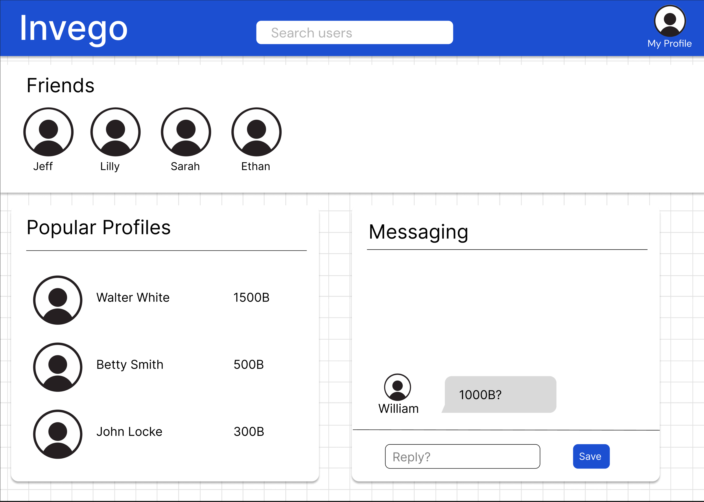
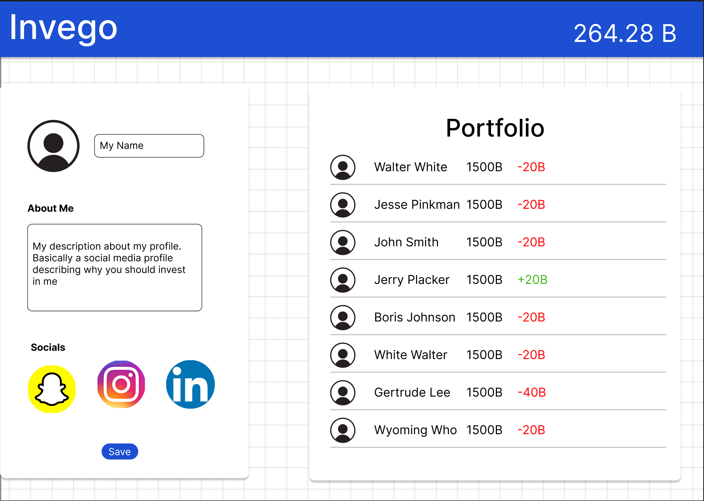
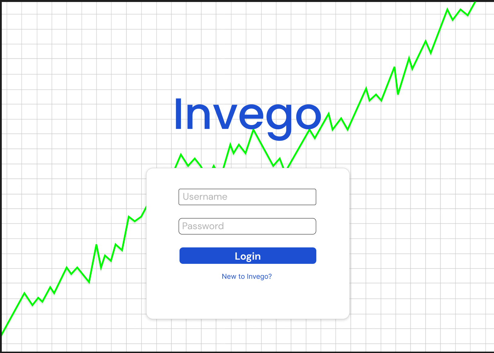
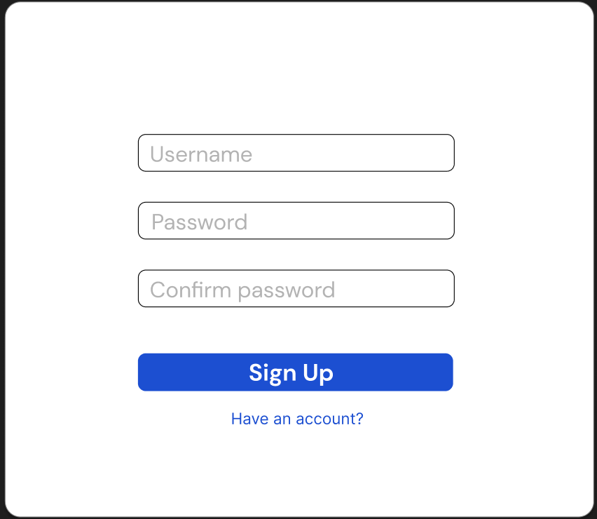
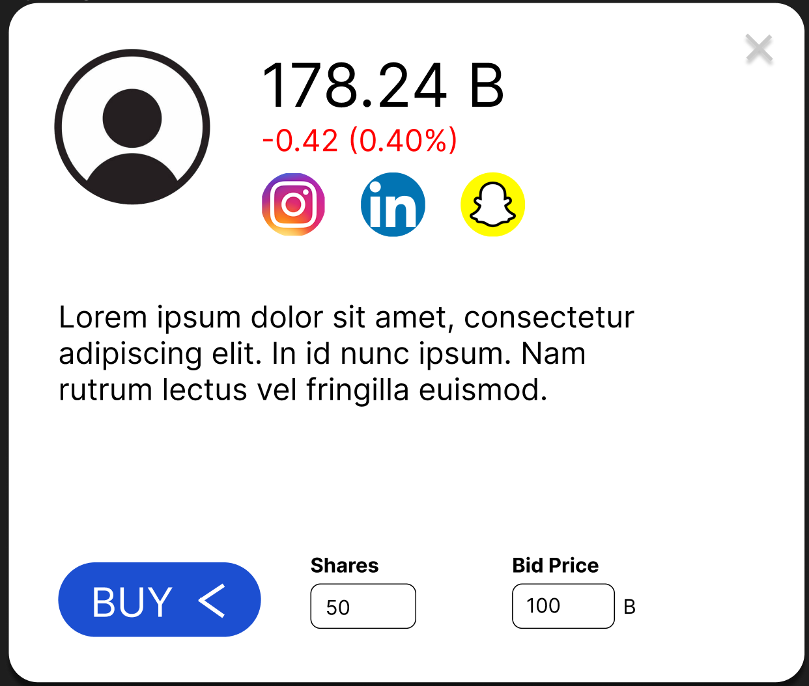

# UI Design

## Wireframe

Our Figma mockup UIs include:

The Invego Discovery page is where the user enters immediately after signing in and where 

The Invego Profile page is a central place to view stocks, edit the user's profile, and see their current Bittlecoin balance. The navigation bar at the top allows the user to navigate to other pages and see their bittle. The portfolio section on the right has a table of the user's stocks, their prices, and their change in price. The bio can include their bio text as well as link buttons to various social media platforms they may have. The circular profile icon is a visual cue consistent amongst all pages. Users can click these icons and will be brought to the buy sell page for that profile. 

The login/sign up pages are important for our users to login in to their account to view their profiles, stocks they own, and what messages they have. 
A login process is necessary to make sure users' accounts are secure.
You can see a text entry for the username, one for the password, a log in button and blue text for otherwise, if you are 'New to Invego?' which will take to the sign up screen. The sign up screen includes many of the same elements, including a username and password entry, a confirm password entry, and otherwise if the user already has an account a link to a 'Have an account?' page. 

Buying and selling is an important function of Invego. Buying and selling makes the Invego marketplace what it is, lively and bustling with opportunity. 
When clicking on a user's profile one can see the buy button, a number input for the amount of shares they want to buy, and another input for the bid price. If they click the arrow within the buy button, into transforms into a button that says 'Sell'. 

## Stories

### Story 1

As an Invego player, I want to be able to view the stocks I own.

I can do this by going to clicking the profile icon from the discovery page

and then on the profile page you can see the stocks you own shares of on the righthand side. 

### Story 2

As an Invego player, I should be able to easily determine what stocks to buy. I should be able to see popular stocks or search for specific stocks.

From the Invego profile page I can see popular stocks in the lower left quadrant, and I can search for users in the top center on the blue navigation bar. 

### Story 3

As an Invego player, I should be able to manage my account and change how I present myself to the world. I should be able to change my bio text and save my changes. 

If I go to the profile page and double click on my bio text I can edit it. When I press the save button at the bottom of the block my changes will be saved.

## HTML & CSS Mockup

Here is the Invego profile page mocked up with HTML and CSS. 

Here is the Invego login page mocked up with HTML and CSS. 

Here is the Invego sign up page mocked up with HTML and CSS. 

Here is the Invego discovery page mocked up with HTML and CSS. 

Here is the Invego buy/sell page mocked up with HTML and CSS. 

